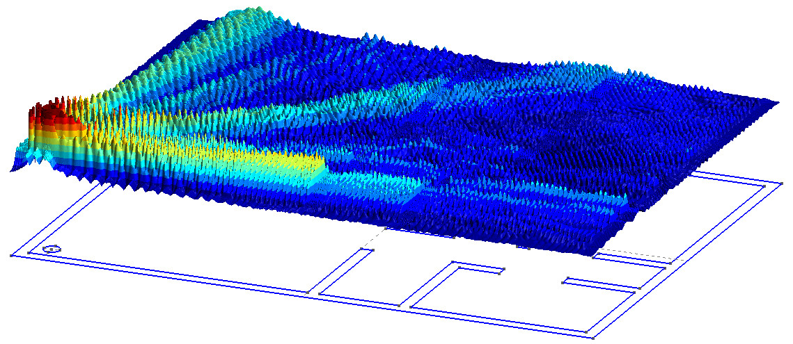

# Wi-Fi waves in a flat

This model uses [onelab](https://onelab.info) to simulate the propagation of a Wi-Fi waves in a flat.

1. Download the [Onelab bundle](https://onelab.info)
2. Download this code
3. Move the binaries `gmsh` and `getdp` into the folder of the code
4. Launch it
    ```bash
    gmsh wifi.pro
    ```
5. Click on run and have fun

Within the graphical interface, it is possible to :

- Modify (a little) the geometry
- Increase the precision (mesh refinement) `NLambda` (between 10 and 20)
- Increase the frequency (set at 1GHz by default). Be **careful**, a simulation with a 2.5GHz frequency is very costly and it can lead to a **computer crash**! Do not complain if you didn't read the README before launching it...

